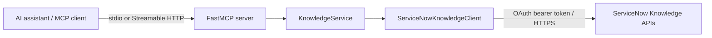

<div align="center">

# ServiceNow Knowledge MCP Server


Connect AI assistants to authoritative ServiceNow Knowledge content. Three focused, read-only tools
for searching articles, browsing categories, and retrieving canonical content—available to any MCP
client over stdio or Streamable HTTP.

</div>

---

`Knowledge API` · `Category hierarchy` · `OAuth client credentials` · `JWT scope enforcement` · `Streamable HTTP` · `stdio`

## What this does

This server gives MCP-compatible AI clients a narrow retrieval interface to ServiceNow Knowledge.
It is designed for grounding an assistant with published enterprise content without granting generic
table access or mutation capabilities.

- **Deterministic and read-only:** no create, update, or delete operations.
- **Retrieval only:** no answer generation, summarization, semantic reranking, vector search, OCR,
  or document parsing.
- **Enterprise-friendly TLS:** uses the operating-system trust store, including managed corporate
  root certificates.
- **Bounded responses:** limits search results, article content, timeouts, and retries.
- **Credential-safe logging:** credentials, authorization headers, and article bodies are not logged.
- **Optional MCP authorization:** validates inbound JWTs and enforces a separate scope per tool.

## Quick start

### 1. Install from source

```bash
git clone https://github.com/Xingyuj/SnowMCP.git
cd SnowMCP
python3 -m venv .venv
source .venv/bin/activate
pip install -e .
```

Python 3.11 or newer is required.

### 2. Configure ServiceNow

```bash
cp .env.example .env
```

Set the ServiceNow instance URL and choose one outbound authentication method:

```dotenv
SERVICENOW_BASE_URL=https://your-instance.service-now.com

# Option A: static bearer token (takes precedence when configured)
SERVICENOW_ACCESS_TOKEN=

# Option B: OAuth client credentials
SERVICENOW_CLIENT_ID=your-client-id
SERVICENOW_CLIENT_SECRET=your-client-secret
SERVICENOW_OAUTH_TOKEN_PATH=oauth_token.do
SERVICENOW_OAUTH_SCOPE=
```

Do not commit `.env` or expose access tokens and client secrets in logs or screenshots.

### 3. Start the server

Streamable HTTP is the default transport:

```bash
servicenow-knowledge-mcp
```

The MCP endpoint is available at `http://127.0.0.1:8080/mcp`.

For a client that launches the server as a subprocess, use stdio:

```bash
TRANSPORT=stdio servicenow-knowledge-mcp
```

### 4. Verify

With the HTTP server running in another terminal:

```bash
python scripts/mcp_client.py list
python scripts/mcp_client.py categories
python scripts/mcp_client.py search "remote access" --limit 5
```

## Configure an MCP client

For clients that accept an MCP server JSON configuration, use the virtual environment executable
and provide credentials through the client environment. Replace `/absolute/path/to/SnowMCP` with
the cloned repository path.

```json
{
  "mcpServers": {
    "servicenow-knowledge": {
      "command": "/absolute/path/to/SnowMCP/.venv/bin/servicenow-knowledge-mcp",
      "env": {
        "TRANSPORT": "stdio",
        "SERVICENOW_BASE_URL": "https://your-instance.service-now.com",
        "SERVICENOW_CLIENT_ID": "your-client-id",
        "SERVICENOW_CLIENT_SECRET": "your-client-secret",
        "SERVICENOW_OAUTH_TOKEN_PATH": "oauth_token.do"
      }
    }
  }
}
```

The same structure is commonly accepted by Claude Desktop, Cursor, and VS Code, although the
configuration file location differs by client. If the client supports remote MCP servers, point it
to the deployed `/mcp` endpoint instead.

## Available tools

| Tool | Description | Default scope when MCP auth is enabled |
| --- | --- | --- |
| `search_knowledge` | Search using a natural-language query or keywords; returns ordered candidates and snippets | `knowledge.search` |
| `list_knowledge_categories` | List every accessible category, including parent IDs and full hierarchy paths | `knowledge.category.read` |
| `get_knowledge_article` | Retrieve canonical article content and publication/validity metadata | `knowledge.article.read` |

Typical retrieval flow:

```text
search_knowledge
      │
      ├── get_knowledge_article
      │
      └── list_knowledge_categories (for discovery or filtering context)
```

`search_knowledge` preserves the order returned by ServiceNow and does not claim semantic, vector,
AI, or UI-equivalent ranking behavior.

## Architecture



The client layer centralizes authentication headers, endpoint construction, field selection,
automatic category pagination, bounded transient retries, error mapping, JSON normalization, and
response limits.

## Configuration

All supported settings and defaults are documented in [`.env.example`](.env.example). The most
important groups are:

| Area | Settings |
| --- | --- |
| ServiceNow connection | `SERVICENOW_BASE_URL`, `SERVICENOW_KNOWLEDGE_API_PATH`, `SERVICENOW_CATEGORIES_API_PATH`, `SERVICENOW_API_VERSION` |
| Outbound authentication | `SERVICENOW_ACCESS_TOKEN`, `SERVICENOW_CLIENT_ID`, `SERVICENOW_CLIENT_SECRET`, `SERVICENOW_OAUTH_TOKEN_PATH`, `SERVICENOW_OAUTH_SCOPE` |
| Retrieval scope | `SERVICENOW_KNOWLEDGE_BASE`, `SERVICENOW_LANGUAGE`, `SERVICENOW_SEARCH_FIELDS`, `SERVICENOW_ARTICLE_FIELDS`, `SERVICENOW_CATEGORY_FIELDS` |
| Response bounds | `DEFAULT_SEARCH_LIMIT`, `MAX_SEARCH_LIMIT`, `CATEGORY_PAGE_SIZE`, `MAX_ARTICLE_CONTENT_CHARS` |
| Reliability | `REQUEST_TIMEOUT_SECONDS`, `TRANSIENT_RETRY_ATTEMPTS`, `RETRY_BACKOFF_SECONDS`, `LOG_LEVEL` |
| Server | `TRANSPORT`, `HOST`, `PORT` |
| Inbound MCP auth | `MCP_AUTH_ENABLED`, `MCP_JWT_JWKS_URI` or `MCP_JWT_PUBLIC_KEY`, issuer, audience, algorithm, and per-tool scopes |

A configured static ServiceNow access token takes precedence over OAuth client credentials. When
client credentials are used, the server obtains and caches the access token automatically.

The default Knowledge API path, field names, and query parameters are implementation assumptions.
Validate them against the API version and customizations of the target ServiceNow instance before
production deployment.

## Authentication and authorization boundary

There are two independent authentication hops:

1. **MCP client → this server:** optional inbound JWT verification using a JWKS endpoint or public
   key, with per-tool scope checks.
2. **This server → ServiceNow:** a static bearer token or OAuth client credentials for the configured
   ServiceNow integration identity.

An integration identity does not prove that each end user's Knowledge ACLs, User Criteria, roles,
group membership, or article restrictions are enforced. The current tools do not accept or invent a
delegated end-user credential. Production use must wait until the applicable entitlement model is
confirmed and tested for the target instance.

See [MCP scope authorization and local testing](docs/mcp-scope-testing.md) for JWT configuration,
scope mapping, test-token generation, and copy-ready calls.

## Docker

```bash
docker build -t servicenow-knowledge-mcp .
docker run --env-file .env -p 8080:8080 servicenow-knowledge-mcp
```

The container runs as a non-root user and exposes the HTTP server on port `8080` by default.

## Local client examples

```bash
python scripts/mcp_client.py list
python scripts/mcp_client.py categories
python scripts/mcp_client.py search "remote access" --limit 5
python scripts/mcp_client.py article ARTICLE_ID
```

The helper uses HTTP/JSON-RPC directly and does not require the FastMCP CLI. See the
[MCP client cheatsheet](docs/mcp-client-cheatsheet.md) for authentication, diagnostics,
copy-ready commands, and troubleshooting.

## Development

```bash
python3 -m venv .venv
source .venv/bin/activate
pip install -e '.[dev]'

pytest
ruff format --check src tests
ruff check src tests
mypy src
```
