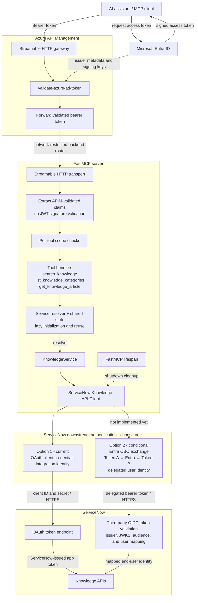

<div align="center">

# ServiceNow Knowledge MCP Server


Connect AI assistants to authoritative ServiceNow Knowledge content. Three focused, read-only tools
for searching articles, browsing categories, and retrieving canonical content—available to any MCP
client over Streamable HTTP.

</div>

---

`Knowledge API` · `Category hierarchy` · `Entra ID` · `Azure APIM` · `Per-tool scopes` · `Streamable HTTP`

## What this does

This server gives MCP-compatible AI clients a narrow retrieval interface to ServiceNow Knowledge.
It is designed for grounding an assistant with published enterprise content without granting generic
table access or mutation capabilities.

- **Deterministic and read-only:** no create, update, or delete operations.
- **Retrieval only:** no answer generation, summarization, semantic reranking, vector search, OCR,
  or document parsing.
- **Enterprise-friendly TLS:** uses the operating-system trust store, including managed corporate
  root certificates.
- **Bounded responses:** limits search results, article content, timeouts, and retries.
- **Credential-safe logging:** credentials, authorization headers, and article bodies are not logged.
- **APIM trust boundary:** APIM validates Entra ID tokens; the MCP server authenticates APIM,
  extracts the already-validated claims, and enforces a separate scope per tool.

## Quick start

### 1. Install from source

```bash
git clone https://github.com/Xingyuj/SnowMCP.git
cd SnowMCP
python3 -m venv .venv
source .venv/bin/activate
pip install -e .
```

Python 3.11 or newer is required.

### 2. Configure ServiceNow

```bash
cp .env.example .env
```

Set the ServiceNow instance URL and choose one outbound authentication method:

```dotenv
SERVICENOW_BASE_URL=https://your-instance.service-now.com

# Option A: static bearer token (takes precedence when configured)
SERVICENOW_ACCESS_TOKEN=

# Option B: OAuth client credentials
SERVICENOW_CLIENT_ID=your-client-id
SERVICENOW_CLIENT_SECRET=your-client-secret
SERVICENOW_OAUTH_TOKEN_PATH=oauth_token.do
SERVICENOW_OAUTH_SCOPE=
```

Do not commit `.env` or expose access tokens and client secrets in logs or screenshots.

### 3. Start the server

The server uses Streamable HTTP:

```bash
servicenow-knowledge-mcp
```

The MCP endpoint is available at `http://127.0.0.1:8080/mcp`.

Everything needed to build, scan, deploy, and provision infrastructure for this service lives under `devops/`:

| Path | What it's for |
|---|---|
| `devops/build/Bupa.ServiceNowAutomation-mcp.yaml` | Main CI/CD pipeline: lint, test, build, push, and SonarQube analysis. Optional deployment adds Helm and APIM stages for dev/test. |
| `devops/build/Bupa.ServiceNowAutomation-pr-policy.yaml` | PR validation pipeline (branch-policy gate on `main`) — build + scan only, no deploy. |
| `devops/build/templates/` | Reusable pipeline steps: `buildMcpImage.yaml`, `deployMcpImage.yaml`, `registerMcpApim.yaml`, `security_scans.yaml`. See `devops/build/readme.md`. |
| `devops/deploy/helm/servicenowautomation-mcp/` | Helm chart (Deployment, Service, ConfigMap, ServiceAccount, PDB, Istio VirtualService/AuthorizationPolicy). See `devops/deploy/readme.md`. |
| `devops/IAC/Terraform/` | Terraform for the app's Azure resources (Key Vault secrets, App Insights, ADO environment/pipeline variables). |
| `devops/IAC/EnvironmentBuilder-AZ.yaml` / `-stages.yaml` | Manually-triggered ADO pipeline to apply/destroy the Terraform. |
| `cacert.crt` *(repo root)* | Bupa internal root CA, baked into the Docker image for TLS trust to internal endpoints. |
| `Dockerfile-SonarQube` *(repo root)* | Build variant used only by the CI SonarQube scan stage. |
| `.dockerignore.sonar` *(repo root)* | SonarQube Docker build exclusions; intentionally retains Git metadata for branch analysis. |
| `.gitignore` *(repo root)* | Standard Python ignores. |

### Docker Build

With the HTTP server running in another terminal:

```bash
python scripts/mcp_client.py list
python scripts/mcp_client.py categories
python scripts/mcp_client.py search "remote access" --limit 5
```

## Configure an MCP client

Configure the client to connect to the deployed Streamable HTTP endpoint. A typical remote MCP
configuration looks like this:

```json
{
  "mcpServers": {
    "servicenow-knowledge": {
      "type": "http",
      "url": "https://your-mcp-host.example/mcp",
      "headers": {
        "Authorization": "Bearer ${MCP_ACCESS_TOKEN}"
      }
    }
  }
}
```

Exact field names and configuration file locations vary by client. In production, the client sends
the Entra ID access token to APIM.

## Available tools

| Tool | Description | Default scope when MCP auth is enabled |
| --- | --- | --- |
| `search_knowledge` | Search using a natural-language query or keywords; returns ordered candidates and snippets | `knowledge.search` |
| `list_knowledge_categories` | List every accessible category, including parent IDs and full hierarchy paths | `knowledge.category.read` |
| `get_knowledge_article` | Retrieve canonical article content and publication/validity metadata | `knowledge.article.read` |

Typical retrieval flow:

```text
search_knowledge
      │
      ├── get_knowledge_article
      │
      └── list_knowledge_categories (for discovery or filtering context)
```

`search_knowledge` preserves the order returned by ServiceNow and does not claim semantic, vector,
AI, or UI-equivalent ranking behavior.

## Architecture



The tool handlers call the service resolver rather than constructing dependencies for every
request. On the first call, the resolver creates the outbound authenticator,
`ServiceNowKnowledgeApiClient`, and `KnowledgeService`, then stores the owned instances in shared
server state. Later calls reuse them, including the HTTP connection pool and cached OAuth token.
When FastMCP shuts down, its lifespan hook closes the owned ServiceNow client and authenticator.

APIM validates the user token's signature, issuer, audience, and expiry. The MCP server deliberately
does not repeat those cryptographic checks: it relies on the enforced APIM-only network boundary,
decodes the forwarded validated token, and applies FastMCP per-tool scope checks.
`APIM_AUTH_ENABLED=false` disables claims extraction and tool scope enforcement and is intended only
for local development.

`KnowledgeService` owns request validation, configured limits, category pagination, and response
construction. `ServiceNowKnowledgeApiClient` owns authentication headers, endpoint construction,
field selection, TLS, bounded transient retries, upstream error mapping, and JSON normalization.
The solid downstream path is implemented today. The dotted OBO path is a conditional design option,
not current behavior.

## Configuration

All supported settings and defaults are documented in [`.env.example`](.env.example). The most
important groups are:

| Area | Settings |
| --- | --- |
| ServiceNow connection | `SERVICENOW_BASE_URL`, `SERVICENOW_KNOWLEDGE_API_PATH`, `SERVICENOW_CATEGORIES_API_PATH`, `SERVICENOW_API_VERSION` |
| Outbound authentication | `SERVICENOW_ACCESS_TOKEN`, `SERVICENOW_CLIENT_ID`, `SERVICENOW_CLIENT_SECRET`, `SERVICENOW_OAUTH_TOKEN_PATH`, `SERVICENOW_OAUTH_SCOPE` |
| Retrieval scope | `SERVICENOW_KNOWLEDGE_BASE`, `SERVICENOW_LANGUAGE`, `SERVICENOW_SEARCH_FIELDS`, `SERVICENOW_ARTICLE_FIELDS`, `SERVICENOW_CATEGORY_FIELDS` |
| Response bounds | `DEFAULT_SEARCH_LIMIT`, `MAX_SEARCH_LIMIT`, `CATEGORY_PAGE_SIZE`, `MAX_ARTICLE_CONTENT_CHARS` |
| Reliability | `REQUEST_TIMEOUT_SECONDS`, `TRANSIENT_RETRY_ATTEMPTS`, `RETRY_BACKOFF_SECONDS`, `LOG_LEVEL` |
| Server | `HOST`, `PORT` |
| APIM claims authorization | `APIM_AUTH_ENABLED`, `APIM_SCOPE_CLAIM_NAMES`, `APIM_SUBJECT_CLAIM_NAMES`, and per-tool scopes |

A configured static ServiceNow access token takes precedence over OAuth client credentials. When
client credentials are used, the server obtains and caches the access token automatically.

The default Knowledge API path, field names, and query parameters are implementation assumptions.
Validate them against the API version and customizations of the target ServiceNow instance before
production deployment.

## Authentication and authorization boundary

There are three distinct security boundaries:

1. **MCP client → APIM:** the client obtains an Entra ID access token. APIM must use
   `validate-azure-ad-token` to verify its signature, issuer, audience, and expiry.
2. **APIM → MCP server:** enforced network controls guarantee that only APIM can reach the backend.
   APIM forwards the validated bearer token, and the MCP server extracts `oid`/`sub` and
   `scp`/`scope`/`roles` without repeating signature validation.
3. **This server → ServiceNow:** choose either a ServiceNow integration identity or, only when the
   target ServiceNow instance supports it, a delegated end-user identity.

APIM must forward the original validated `Authorization: Bearer ...` header because the MCP server
uses its claims for tool authorization. The APIM-only network restriction is a mandatory security
control for this design; exposing the backend through another route would allow unvalidated claims
to reach the MCP server.

### ServiceNow downstream identity options

| Option | Flow | Authorization identity | Status and ServiceNow requirement |
| --- | --- | --- | --- |
| **1. Client credentials** | The MCP server calls the ServiceNow OAuth token endpoint with its client credentials, caches the returned access token, and uses it for Knowledge API calls. | A ServiceNow integration user/application. | Implemented. ServiceNow ACLs and User Criteria are evaluated for the integration identity, not the original MCP user. |
| **2. Entra OBO** | The MCP server exchanges the incoming MCP access token (Token A) at Entra for a new delegated token whose audience is ServiceNow (Token B), then sends Token B to ServiceNow. | The mapped end user. | Not implemented. ServiceNow must accept the Entra-issued downstream token for inbound API calls, validate its issuer, JWKS, audience, expiry, and scopes, map its user claim to `sys_user`, and apply the required API access policy, ACLs, and User Criteria. |

OBO does **not** mean forwarding Token A directly to ServiceNow. Token A is issued for the MCP API
and must only be presented to that audience. The MCP server uses Token A as the assertion in the
[Entra OBO exchange](https://learn.microsoft.com/en-us/entra/identity-platform/v2-oauth2-on-behalf-of-flow)
and receives Token B for the ServiceNow audience.

The ServiceNow configuration is more specific than merely enabling OpenID Connect for interactive
SSO. The ServiceNow team must configure
[inbound third-party OIDC token validation](https://www.servicenow.com/docs/r/platform-security/authentication/add-OIDC-entity.html)
for the target Knowledge APIs and confirm that the instance/release accepts the Entra OBO
**access token**. Current ServiceNow documentation describes third-party OIDC inbound API
authentication, but its detailed setup primarily demonstrates an **ID token** in the
`Authorization` header. Because Entra OBO returns an access token, compatibility must be proven with
the target instance before selecting this option.

Until that validation and the OBO code path are complete, this server uses the integration-identity
path. A configured static ServiceNow bearer token remains available operationally, but it has the
same authorization limitation: it does not preserve the original MCP user's identity.

See [APIM claims authorization and local testing](docs/mcp-scope-testing.md) for the APIM contract,
scope mapping, and copy-ready calls.

## Docker

```bash
docker build -t servicenow-knowledge-mcp .
docker run --env-file .env -p 8080:8080 servicenow-knowledge-mcp
```

The container runs as a non-root user and exposes the HTTP server on port `8080` by default.

## Local client examples

```bash
python scripts/mcp_client.py list
python scripts/mcp_client.py categories
python scripts/mcp_client.py search "remote access" --limit 5
python scripts/mcp_client.py article ARTICLE_ID
```

The helper uses HTTP/JSON-RPC directly and does not require the FastMCP CLI. See the
[MCP client cheatsheet](docs/mcp-client-cheatsheet.md) for authentication, diagnostics,
copy-ready commands, and troubleshooting.

## Development

```bash
python3 -m venv .venv
source .venv/bin/activate
pip install -e '.[dev]'

pytest
ruff format --check src tests
ruff check src tests
mypy src
```