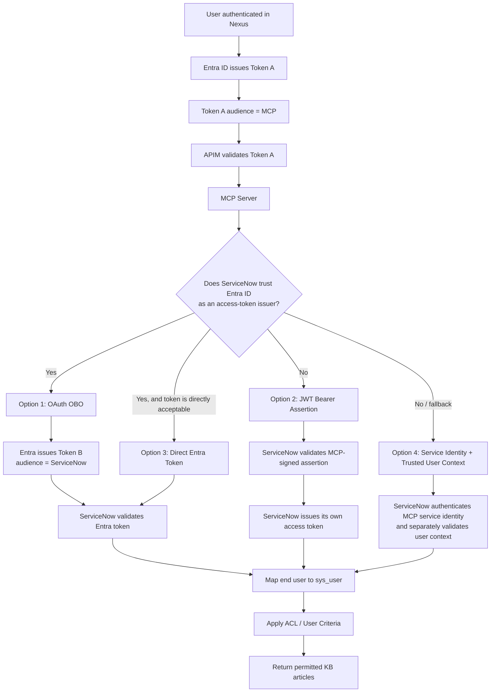
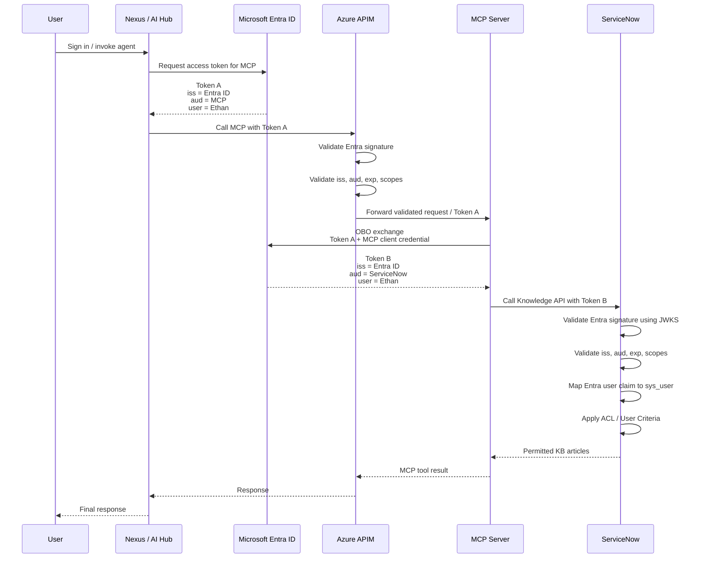
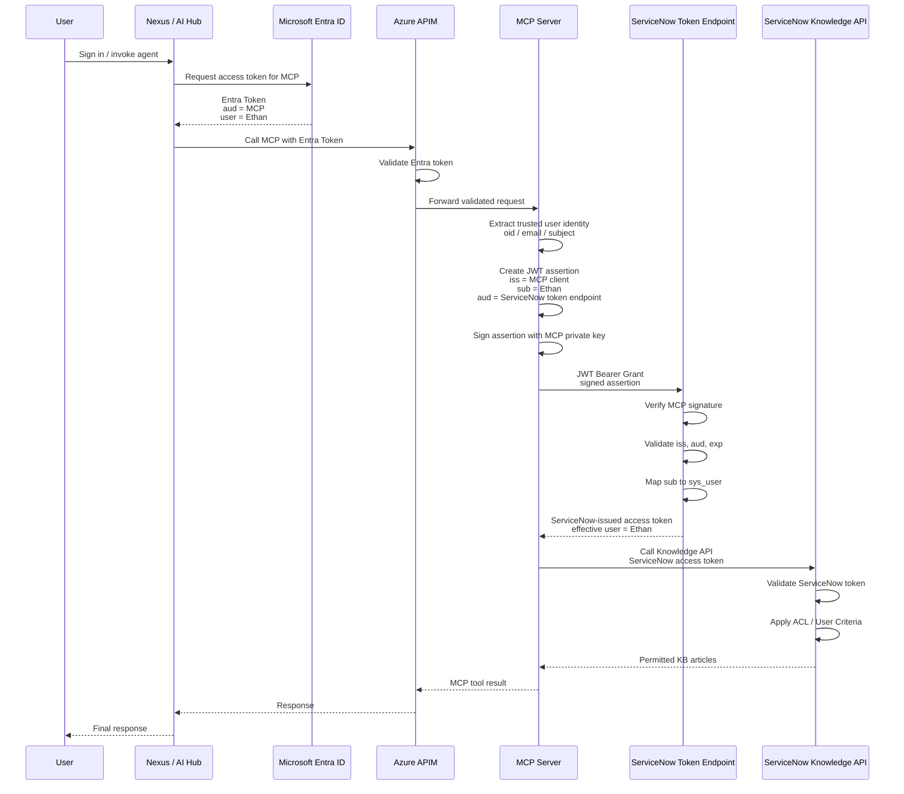
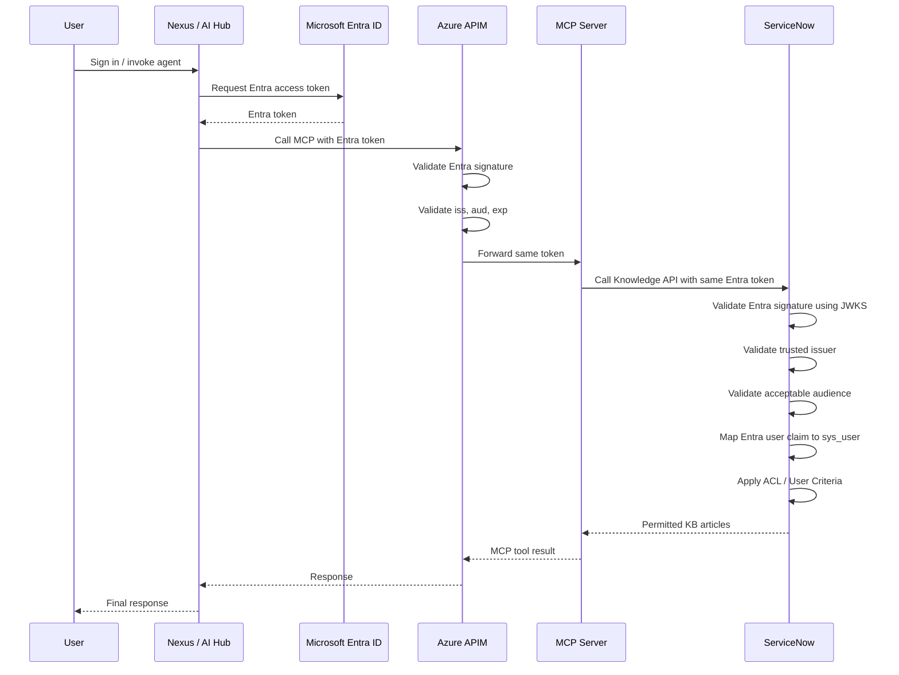
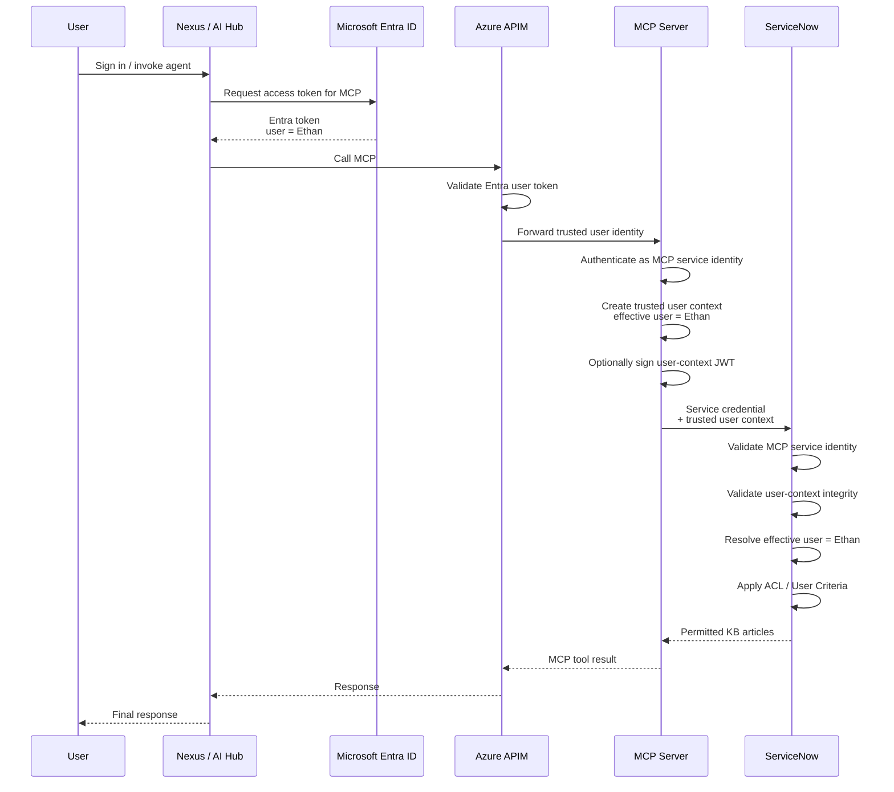
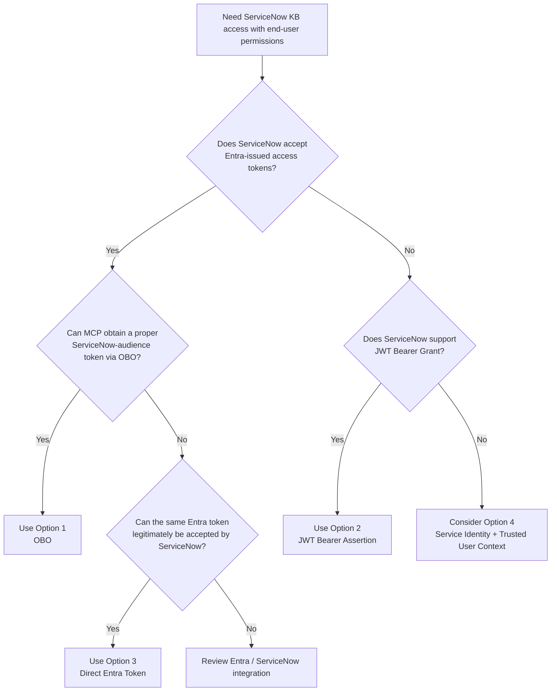

# ServiceNow MCP Authentication Options

This document compares authentication patterns for:

`User -> Nexus / AI Hub -> Azure APIM -> MCP Server -> ServiceNow`

The key design question is:

> **Does ServiceNow trust Microsoft Entra ID as an issuer for inbound access tokens?**

---

## Architecture Decision Summary



---

# Option 1 - OAuth On-Behalf-Of (OBO)

## When to use

Use this option when:

- Nexus obtains an Entra access token for the MCP API.
- ServiceNow is configured to trust Microsoft Entra ID.
- ServiceNow has an API/resource audience registered in Entra.
- ServiceNow can validate Entra-issued access tokens and map the end user to `sys_user`.

## Important

OBO does **not** remove the requirement for ServiceNow to trust Entra ID.

The exchanged downstream token is still issued by Entra:

```text
Token A
iss = Entra ID
aud = MCP

        OBO exchange

Token B
iss = Entra ID
aud = ServiceNow
```

ServiceNow must therefore validate:

- Entra issuer (`iss`)
- Entra signing key / JWKS
- ServiceNow audience (`aud`)
- expiry (`exp`)
- scopes / delegated permissions
- user identity claims

## Sequence



## Trust relationship

```text
APIM trusts Entra
MCP trusts APIM / validated Entra identity
ServiceNow trusts Entra
```

---

# Option 2 - JWT Bearer Assertion to ServiceNow

## When to use

Use this option when:

- ServiceNow does not directly accept Entra access tokens for the Knowledge API.
- ServiceNow supports JWT Bearer Grant / JWT-based token exchange.
- ServiceNow can trust the MCP application's signing certificate/public key.
- ServiceNow can map the assertion's `sub` claim to a `sys_user`.

## Important

In this model, the user first authenticates through Entra, but the final Knowledge API access token is issued by ServiceNow.

The MCP Server does **not** forward the Entra token to the Knowledge API.

Instead:

1. MCP validates or receives a trusted Entra user identity.
2. MCP creates a signed JWT assertion.
3. ServiceNow validates the assertion.
4. ServiceNow issues its own access token.
5. MCP calls the Knowledge API with the ServiceNow token.

## Sequence



## Trust relationship

```text
APIM trusts Entra

ServiceNow does NOT need to accept the Entra access token directly.

ServiceNow trusts:
MCP signing certificate / public key
        ↓
JWT assertion
        ↓
ServiceNow issues its own access token
```

---

# Option 3 - ServiceNow Directly Accepts the Same Entra Token

## When to use

Use this option only when ServiceNow is explicitly configured to accept the Entra token already presented to APIM / MCP.

This requires ServiceNow to trust:

- the Entra tenant / issuer
- Entra JWKS signing keys
- the token audience
- the relevant user claims

## Critical audience issue

This is only valid if the same token is legitimately intended for ServiceNow.

For example, this token is normally **not** sufficient:

```text
iss = Entra ID
aud = MCP
```

ServiceNow should normally reject it because:

```text
aud != ServiceNow
```

Therefore this design requires an explicit ServiceNow / Entra configuration that makes the token acceptable to both components, or another architecture where APIM is validating a token whose intended protected resource is also compatible with ServiceNow.

Do not assume that a valid Entra signature alone is sufficient.

## Sequence



## Trust relationship

```text
APIM trusts Entra
ServiceNow also trusts Entra
```

This is simpler operationally, but the `aud` design must be explicitly confirmed.

---

# Option 4 - MCP Service Identity + Trusted User Context

## When to use

Use this option when:

- MCP authenticates to ServiceNow using a service account / service identity.
- ServiceNow does not directly use the user's Entra access token.
- The end-user identity must still be propagated separately.
- ServiceNow has a supported and trusted mechanism for resolving that user context.

## Important

A plain header such as:

```text
X-End-User: ethan@company.com
```

must not be trusted by itself.

The user context must be cryptographically protected or otherwise guaranteed by a trusted gateway/channel.

Examples:

- signed user-context JWT
- mutually authenticated trusted proxy
- APIM-generated signed identity context
- ServiceNow-supported impersonation/delegation mechanism

## Sequence



## Trust relationship

```text
ServiceNow authenticates:
MCP service identity

ServiceNow authorizes against:
trusted propagated end-user identity
```

This design requires particularly careful security review because authentication identity and effective user identity are separate.

---

# Comparison

| Option | Final API Token Issuer | Does ServiceNow Need to Trust Entra Access Tokens? | Preserves End-User Context? | Main Requirement |
|---|---|---:|---:|---|
| 1. OBO | Entra ID | Yes | Yes | ServiceNow must accept Entra token with `aud = ServiceNow` |
| 2. JWT Bearer Assertion | ServiceNow | No, not for final API token | Yes | ServiceNow trusts MCP-signed assertion and maps `sub` to `sys_user` |
| 3. Direct Entra Token | Entra ID | Yes | Yes | Same token must have an audience ServiceNow legitimately accepts |
| 4. Service Identity + User Context | Usually ServiceNow / service credential provider | No | Potentially | Trusted user-context propagation / impersonation mechanism |

---

# Recommended Decision Order



---

# Questions for the ServiceNow Team

1. **Is our ServiceNow instance configured to trust Microsoft Entra ID as an issuer for inbound OAuth access tokens?**

2. **If yes, what Entra audience must the token contain for the ServiceNow Knowledge API?**

3. **Does ServiceNow validate Entra tokens using Entra JWKS / signing keys?**

4. **Which Entra claim is mapped to `sys_user` — `oid`, `sub`, email, UPN, or another claim?**

5. **Can an MCP backend use OAuth On-Behalf-Of to obtain a ServiceNow-audience Entra token?**

6. **If ServiceNow does not directly accept Entra access tokens, does the instance support OAuth JWT Bearer Grant?**

7. **For JWT Bearer Grant, can the assertion `sub` be mapped to the target `sys_user` so that ACL and User Criteria run as that user?**

8. **When calling the Knowledge API, are ACL and Knowledge User Criteria evaluated against the effective authenticated user?**

9. **Is there an approved service-account plus trusted-user-context / impersonation pattern already used internally?**

---

# Core Security Requirement

Regardless of the selected option, the following identity chain must remain trustworthy:

```text
Nexus authenticated user
        =
MCP effective end user
        =
ServiceNow sys_user
        =
User evaluated by ACL / User Criteria
```

If ServiceNow only sees a shared MCP service account and does not have a trusted effective-user mechanism, all users may end up receiving the same ServiceNow permissions.
