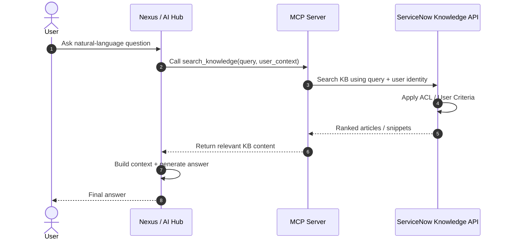
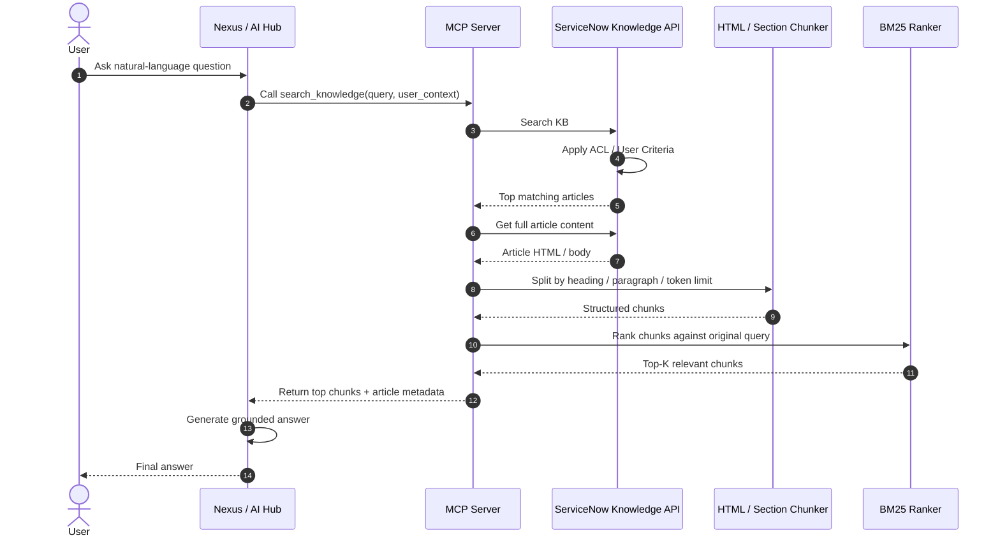
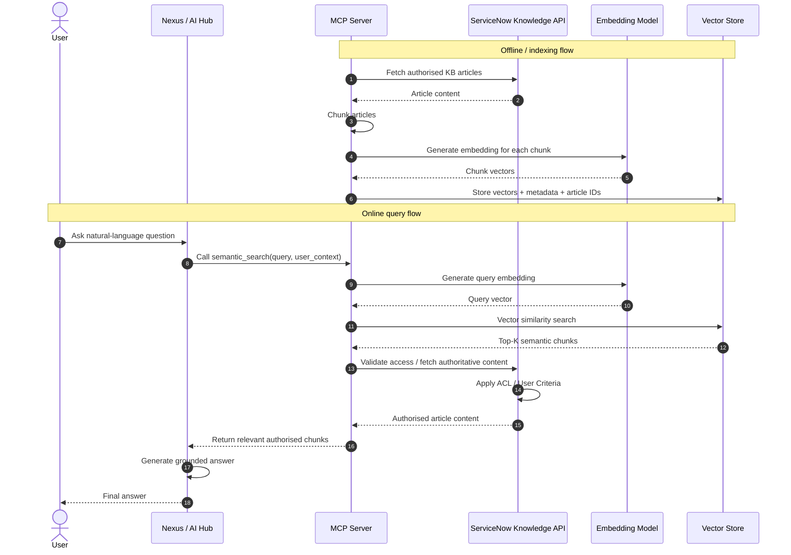
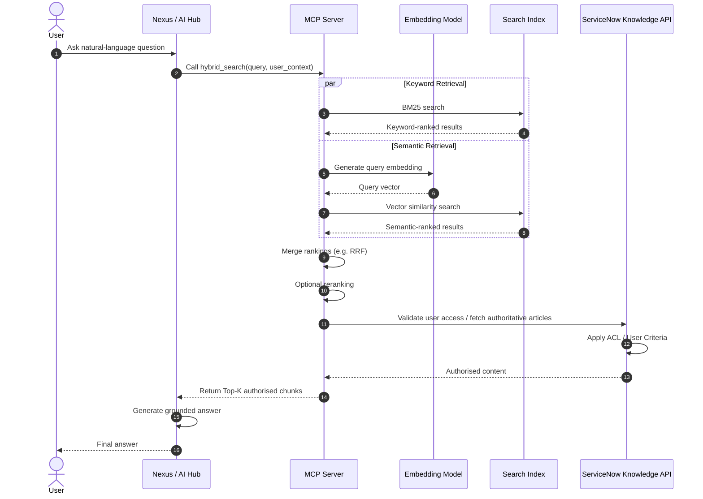
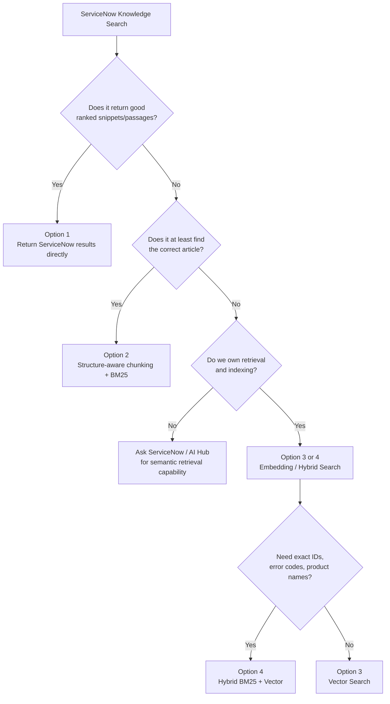

# ServiceNow KB Retrieval / Chunking Design Options

Below are several possible designs for the MCP + ServiceNow Knowledge retrieval flow.

---

## Option 1 — ServiceNow Retrieval Only

**Use when:** ServiceNow Knowledge Search already returns sufficiently relevant articles/snippets.



### Characteristics

- No MCP-side chunking
- No BM25
- No embedding model
- No vector database
- Lowest implementation complexity
- Best option if ServiceNow already provides good retrieval and snippets

---

## Option 2 — ServiceNow Retrieval + Structure-Aware Chunking + BM25

**Use when:** ServiceNow can find the correct article, but the article body is too large to send directly to the LLM.



### Characteristics

- ServiceNow remains responsible for article-level retrieval
- MCP only performs article-level content reduction
- Chunking can be deterministic:
  - H1 / H2 / H3
  - paragraphs
  - lists
  - token-size fallback
- BM25 provides lightweight intra-article ranking
- No embedding model
- No vector database
- No extra LLM call inside MCP

### Recommended first implementation

This is a strong default if ServiceNow returns whole articles rather than matched passages.

---

## Option 3 — MCP Semantic Retrieval with Embeddings

**Use when:** ServiceNow article-level retrieval is not sufficient and semantic matching is required inside the retrieved content.



### Characteristics

- Requires an embedding model
- Requires a vector index/store
- Requires KB synchronisation
- Requires re-indexing when content changes
- Requires careful ACL / User Criteria handling
- More operational complexity

### Important concern

If ServiceNow is the source of truth, the vector index must not become an ACL bypass.

---

## Option 4 — Hybrid Search: BM25 + Vector Search

**Use when:** High retrieval quality is required for both exact enterprise terms and natural-language semantic queries.



### Characteristics

- BM25 handles:
  - KB IDs
  - product names
  - error codes
  - exact terminology
- Vector search handles:
  - synonyms
  - paraphrases
  - natural-language intent
- Usually higher retrieval quality than pure vector search
- Highest architectural complexity among these options

---

## Recommended Decision Path



---

## Suggested Initial Architecture

For the current MCP integration, the preferred initial design is:

```text
ServiceNow Knowledge Search
        ↓
Top matching article(s)
        ↓
MCP fetches article content
        ↓
Structure-aware chunking
        ↓
Optional BM25 ranking
        ↓
Top relevant chunks
        ↓
Nexus / LLM
        ↓
Final answer
```

This keeps ServiceNow responsible for access control and article discovery while preventing the MCP from becoming a second full RAG platform prematurely.
